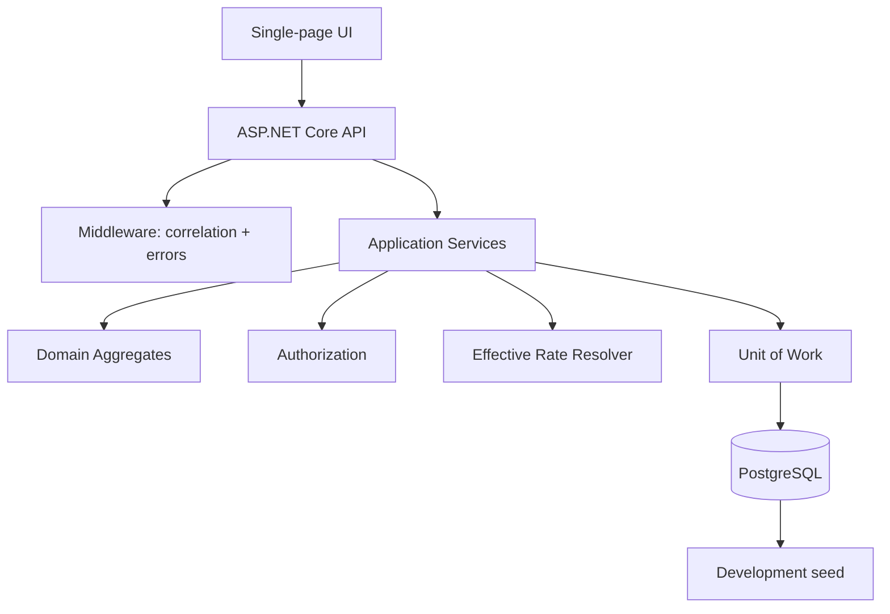
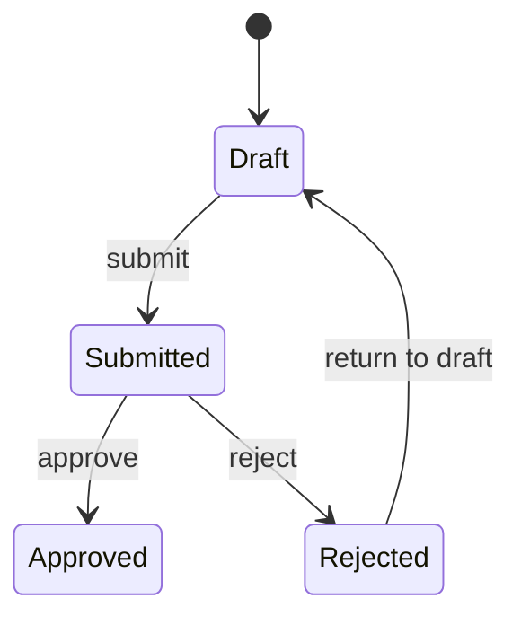

# Cost Estimating — Design

## 1. Problem

This application models a construction estimating workflow. An estimator builds an estimate from catalogue items, each line is priced using the catalogue rate effective on the estimate pricing date, and a reviewer can approve or reject the submitted estimate. Once approved, the estimate is treated as the project's commercial record.

The important engineering boundaries are not CRUD operations but business invariants: money precision, effective-dated pricing, unique catalogue items per estimate, lifecycle transitions, project-level authorization, role-specific visibility, auditability, and safe approval retries.

## 2. Assumptions and ambiguities

### Project manager

The brief defines exactly three roles: Estimator, Reviewer and Viewer, but also refers to a project manager. I interpret project manager as a project-level responsibility rather than a fourth global role. `ProjectAssignment.IsProjectManager` models that responsibility.

### Reviewer-created estimate

A reviewer may not approve an estimate they created. The same separation is applied to rejection for consistency.

### Rate snapshot

When an estimate line is added or updated, the effective rate and labour cost are copied to the line. This protects the historical commercial record from later catalogue changes.

### Repeated catalogue item

The domain updates the existing line. The database also has a unique `(EstimateId, CatalogueItemId)` constraint as a concurrency safety net.

### Identity

Authentication is intentionally out of scope. The API accepts `X-User-Email`; the server resolves role and project assignments from its own database.

## 3. Architecture



Dependency direction:

```text
API -> Application -> Domain
Infrastructure -> Application + Domain
Domain -> nothing external
```

The domain is structurally protected by architecture tests.

## 4. Domain model

### Aggregate root

`Estimate` is the aggregate root. `EstimateLine` belongs to it conceptually and cannot be changed once the estimate is approved.

### Entities

- Project
- User
- ProjectAssignment
- CatalogueItem
- CatalogueRate
- Estimate
- EstimateLine
- EstimateAuditEvent

### Invariants

- Quantity > 0.
- Quantity <= 3 decimal places.
- Markup is 0..100 and <= 2 decimal places.
- Money is rounded to 2 decimals using AwayFromZero.
- Estimate total is the sum of line totals.
- A catalogue item appears at most once per estimate.
- Only Draft can be edited.
- Only Draft can be submitted, and only with lines and a non-future pricing date.
- Only Submitted can be approved/rejected.
- Only Rejected can return to Draft.
- Approved description correction is a separate project-manager-only capability.

## 5. State machine



No other lifecycle transitions are supported.

## 6. Authorization

| Capability | Estimator | Reviewer | Viewer | Project Manager |
|---|---:|---:|---:|---:|
| Read assigned project | Yes | Yes | Yes | Yes |
| Edit draft | Yes | No | No | No |
| Submit | Yes | No | No | No |
| Approve | No | Yes | No | No |
| Reject | No | Yes | No | No |
| Correct approved description | No | No | No | Yes |
| See labour cost | No | Yes | No | Yes |

Project manager is not a fourth global role; it is an assignment capability.

## 7. Persistence

PostgreSQL is used because the domain benefits from relational constraints, transactions, numeric precision, foreign keys, indexes and a simple Docker setup.

Important indexes/constraints:

- unique user email
- unique catalogue code
- `(EstimateId, CatalogueItemId)` unique
- estimate project index
- estimate line estimate index
- catalogue rate `(CatalogueItemId, EffectiveFrom)` index

## 8. Effective-dated rate

For an estimate pricing date `D`, the selected rate is:

```text
max(EffectiveFrom) where EffectiveFrom <= D
```

The selected rate is copied to the estimate line.

## 9. Concurrency / retry

Approval is performed inside a transaction. `Estimate.Version` is a concurrency token and the lifecycle itself prevents a second approval. The audit event is written in the same transaction.

A production implementation could additionally use a database-side conditional update for the transition and an idempotency key if clients require stronger distributed retry semantics.

## 10. Error handling

One exception middleware maps expected failures to HTTP semantics:

- 400 validation/domain failure
- 401 unknown/missing identity
- 403 authorization failure
- 404 missing resource
- 409 invalid lifecycle/concurrency conflict
- 500 unexpected failure

Responses use a ProblemDetails-style JSON structure and expose a trace identifier.

## 11. Observability

Structured log messages include operation, estimate id, catalogue item id and user identity. A correlation id is returned in `X-Correlation-ID`.

Secrets are not logged.

## 12. Scale

The database is indexed by the relationships used by estimate retrieval. Read paths use projection and do not eagerly materialize unrelated aggregates. At 50,000 lines, the next production step would be API keyset pagination and UI virtualization if the UX requires incremental rendering. The current contract returns the estimate and its lines because that is the explicit exercise requirement.

## 13. Scope

Implemented:

- projects
- estimate creation
- estimate retrieval
- line add/update
- effective-dated rates
- lifecycle
- approval/rejection
- authorization
- labour visibility
- project assignment checks
- audit
- rejected-to-draft transition
- errors
- structured logging/correlation
- database persistence
- seed data
- UI role switcher
- tests
- architecture enforcement
- CI and documentation

Deliberately not implemented:

- real authentication/JWT
- user administration
- catalogue management UI
- full project management UI
- distributed event bus
- Kubernetes/cloud deployment
- advanced pagination UI
- full end-to-end browser test suite

These are outside the minimum functional slice and would dilute the high-risk business-rule work.

## 14. SDLC

The repository should be committed in stages:

1. `docs: add initial architecture and assumptions`
2. `chore: configure postgres persistence`
3. `feat: implement estimate domain and lifecycle`
4. `feat: implement effective dated rate resolution`
5. `feat: add estimate api`
6. `feat: enforce project and role authorization`
7. `feat: add audit and concurrency handling`
8. `feat: add estimate ui`
9. `test: cover high risk business rules`
10. `test: add architecture enforcement`
11. `docs: add requirements traceability and AI usage`
12. `ci: validate build and tests`
