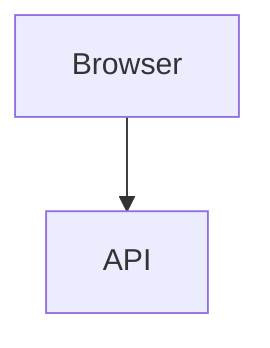

# Design

> Commit this file **before** you write application code. Delete these quoted instruction lines as you fill it in.
> Target: ~25 minutes. Brevity is fine; thinking is not optional.

## 1. The problem in my own words

> Two or three paragraphs. Not a restatement of the brief — tell us what you think this system is really for and what makes it non-trivial.

## 2. Assumptions, ambiguities and open questions

> The requirements are under-specified in places, and at least one part of them does not hold together.
> For each thing you found: what it is, what you decided, and what you would have asked the customer.
> This section carries real weight.

| # | What I found | My decision | What I'd ask the customer |
|---|---|---|---|
|   |              |             |                           |

## 3. Architecture

> A diagram — Mermaid, ASCII, or a photo of paper. Then a short walkthrough:
> what the pieces are, which way the dependencies point, and where the boundary rules live.

**Dependency rules I am imposing on myself:**

-

## 4. Domain model

> Entities, value objects, aggregate boundaries, invariants, the state machine.
> Say which invariants are enforced at construction and which are checked later, and why.

**Aggregates:**

**Value objects:**

**Invariants:**

**State machine:**

## 5. Scope for these three hours

**Building:**

**Deliberately not building, and why:**

**Next, with another day:**
